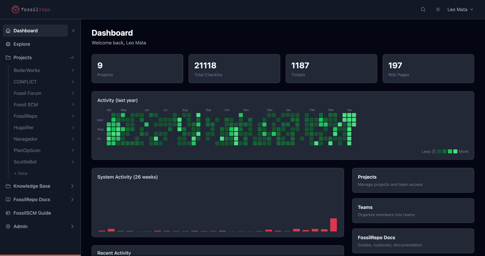

# Fossilrepo

**Self-hosted Fossil forge with a modern web interface.**



Fossilrepo wraps [Fossil SCM](https://fossil-scm.org) with a Django + HTMX management layer, replacing Fossil's built-in web UI with a GitHub/GitLab-caliber experience while preserving everything that makes Fossil unique: single-file repos, built-in wiki, tickets, forum, and technotes.

**Live instance:** [fossilrepo.io](https://fossilrepo.io) | **Docs:** [fossilrepo.dev](https://fossilrepo.dev) | **Powered by [BoilerWorks](https://boilerworks.ai)**

## Why Fossilrepo?

Fossil is the most underrated version control system. Every repository is a single SQLite file containing your code, wiki, tickets, forum, and technotes. No external services, no complex setup. But its web UI hasn't changed since 1998.

Fossilrepo fixes that. You get:

- A modern dark/light UI built with Django, HTMX, Alpine.js, and Tailwind CSS
- GitHub-style code browser with line numbers, blame, history, and syntax highlighting
- Timeline with DAG graph showing fork/merge connectors and color-coded branches
- Full ticket CRUD with filters, comments, and CSV export
- Wiki with Markdown + Fossil markup + Pikchr diagram rendering
- Forum with threaded discussions
- Releases with file attachments and markdown changelogs
- Git mirror sync to GitHub/GitLab via OAuth
- Clone/push/pull over HTTP and SSH through Django's auth layer
- Webhook dispatch with HMAC signing and delivery logs
- Omnibus Docker image with Fossil compiled from source

All while Fossil remains the source of truth. Fossilrepo reads `.fossil` files directly via SQLite for speed, and uses the `fossil` CLI for writes to preserve artifact integrity.

## Stack

| Layer | Technology |
|-------|-----------|
| Backend | Django 5 (Python 3.12+) |
| Frontend | HTMX 2.0 + Alpine.js 3 + Tailwind CSS (CDN) |
| Database | PostgreSQL 16 (app data) + SQLite (Fossil repos) |
| Cache/Broker | Redis 7 |
| Jobs | Celery + Redis |
| Auth | Session-based (httpOnly cookies) |
| SCM | Fossil 2.24 (compiled from source in Docker) |
| Linter | Ruff |

## Quick Start

```bash
git clone https://github.com/ConflictHQ/fossilrepo.git
cd fossilrepo
docker compose up -d --build

# Run migrations and seed sample data
docker compose exec backend python manage.py migrate
docker compose exec backend python manage.py seed

# Open the app
open http://localhost:8000
```

**Default users:** `admin` / `admin` (superuser) and `viewer` / `viewer` (read-only).

## Features

### Code Browser
- Directory navigation with breadcrumbs
- Syntax-highlighted source view with line numbers and permalinks
- Blame with age-based coloring (newest = brand red, oldest = gray)
- File history, raw download, rendered preview for Markdown/HTML

### Timeline
- DAG graph with fork/merge connectors, color-coded branches
- Merge commit diamonds, leaf indicators
- Keyboard navigation (j/k/Enter), HTMX infinite scroll
- RSS feed

### Diffs
- Unified and side-by-side view (toggle with localStorage preference)
- Syntax highlighting via highlight.js
- Line-level permalinks
- Compare any two checkins

### Tickets
- Filter by status, type, priority, severity
- Full CRUD: create, edit, close/reopen, comment
- CSV export
- Pagination with configurable page size

### Wiki
- Markdown + Fossil wiki markup + raw HTML
- Pikchr diagram rendering
- Right-sidebar table of contents
- Create and edit pages

### Forum
- Threaded discussions (Fossil-native + Django-backed posts)
- Create threads, post replies
- Markdown body with preview

### Releases
- Versioned releases with tag names and markdown changelogs
- File attachments with download counts
- Draft and prerelease support

### Sync
- Pull from upstream Fossil remotes
- Git mirror to GitHub/GitLab (OAuth or SSH key auth)
- Clone/push/pull over HTTP via `fossil http` CGI proxy
- SSH push via restricted sshd (port 2222)
- Configurable sync modes: on-change, scheduled, both

### Webhooks
- Outbound webhooks on checkin, ticket, wiki, and release events
- HMAC-SHA256 signed payloads
- Exponential backoff retry (3 attempts)
- Delivery log with response status and timing

### Organization
- Single-org model with teams and members
- User CRUD: create, edit, deactivate, change password
- Team management with member assignment
- Project-level team roles: read, write, admin
- Project visibility: public, internal, private

### Infrastructure
- Omnibus Docker image (Fossil compiled from source)
- Caddy for SSL termination and subdomain routing
- Litestream for continuous SQLite-to-S3 replication
- Celery Beat for scheduled metadata sync and upstream checks
- Encrypted credential storage (Fernet/AES-128-CBC at rest)

## Architecture

```
Browser
  |
  v
Django 5 + HTMX + Alpine.js + Tailwind CSS
  |
  |-- FossilReader (direct SQLite reads from .fossil files)
  |-- FossilCLI (subprocess wrapper for write operations)
  |-- fossil http (CGI proxy for clone/push/pull)
  |
  |-- PostgreSQL 16 (orgs, users, teams, projects, settings)
  |-- Redis 7 (Celery broker, cache)
  |-- Celery (background sync, webhooks, notifications)
  |
  v
.fossil files (SQLite — code + wiki + tickets + forum + technotes)
  |
  v
Litestream --> S3 (continuous backup)
```

No separate frontend service. Django serves everything: templates, static files, and HTMX partials.

## Configuration

All runtime settings are configurable via Django admin (Constance):

| Setting | Default | Description |
|---------|---------|-------------|
| `SITE_NAME` | Fossilrepo | Display name |
| `FOSSIL_DATA_DIR` | /data/repos | Where .fossil files live |
| `FOSSIL_BINARY_PATH` | fossil | Path to the fossil binary |
| `FOSSIL_STORE_IN_DB` | false | Store .fossil snapshots via Django file storage |
| `FOSSIL_S3_TRACKING` | false | Track S3/Litestream replication |
| `GIT_SYNC_MODE` | disabled | Default sync mode for new mirrors |
| `GIT_SYNC_SCHEDULE` | */15 * * * * | Default cron for scheduled sync |

See [`.env.example`](.env.example) for all environment variables and [`.env.production.example`](.env.production.example) for production configuration.

## Development

```bash
# Local development (without Docker)
uv sync --all-extras
DJANGO_DEBUG=true POSTGRES_HOST=localhost uv run python manage.py runserver

# Run tests
DJANGO_DEBUG=true uv run pytest

# Lint
ruff check . && ruff format --check .
```

See [`CONTRIBUTING.md`](CONTRIBUTING.md) for the full development guide and [`bootstrap.md`](bootstrap.md) for codebase conventions.

## License

MIT License. See [LICENSE](LICENSE) for details.

---

Built by [CONFLICT](https://weareconflict.com). Fossilrepo is open source under the MIT license.
