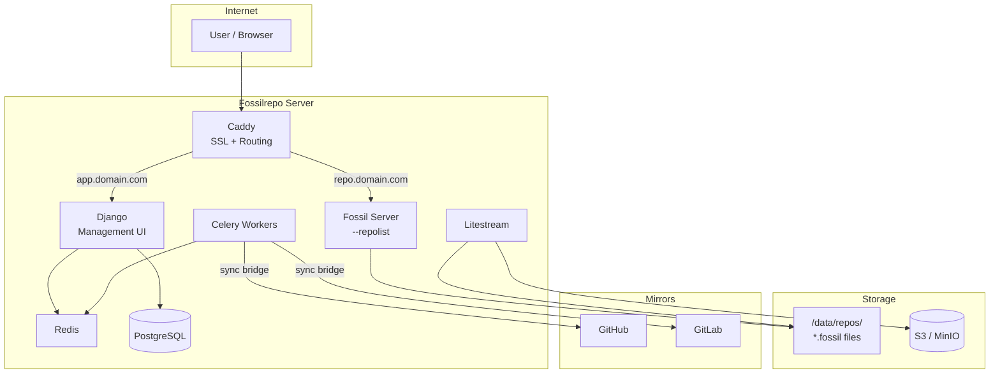

# Architecture Overview

Fossilrepo is a thin orchestration layer around Fossil SCM. Fossil does the heavy lifting -- fossilrepo handles provisioning, routing, backups, and the management UI.

## System Diagram

## Components

### Fossil Server

A single `fossil server --repolist /data/repos/` process serves all repositories. Each `.fossil` file is a self-contained SQLite database with VCS history, issues, wiki, and forum.

Adding a new repo is just `fossil init /data/repos/name.fossil` -- no restart needed.

### Caddy

Handles SSL termination and subdomain routing:

- `your-domain.com` routes to the Django management UI
- `reponame.your-domain.com` routes directly to Fossil's web UI

Caddy automatically provisions and renews Let's Encrypt certificates.

### Django Management Layer

Provides the administrative interface:

- Repository lifecycle (create, configure, archive)
- User and organization management
- Dashboard and analytics
- Sync bridge configuration

Django uses HTMX for interactive UI without a JavaScript framework.

### Litestream

Continuously replicates every `.fossil` SQLite file to S3-compatible storage. Provides:

- **Continuous backup** -- WAL frames replicated in near-real-time
- **Point-in-time recovery** -- restore to any moment, not just snapshots
- **Zero-config per repo** -- new `.fossil` files are picked up automatically

### Celery Workers

Handle background tasks:

- Sync bridge execution (Fossil to Git mirroring)
- Scheduled sync jobs
- Upstream pull operations

## Data Flow

1. **User pushes to Fossil** -- standard `fossil push` or `fossil sync`
2. **Fossil writes to `.fossil` file** -- SQLite transactions
3. **Litestream replicates** -- WAL frames streamed to S3
4. **Sync bridge runs** -- Celery task mirrors changes to Git remotes
5. **Django reflects state** -- reads from Fossil SQLite for dashboards

Fossil is always the source of truth. Everything else is derived.
