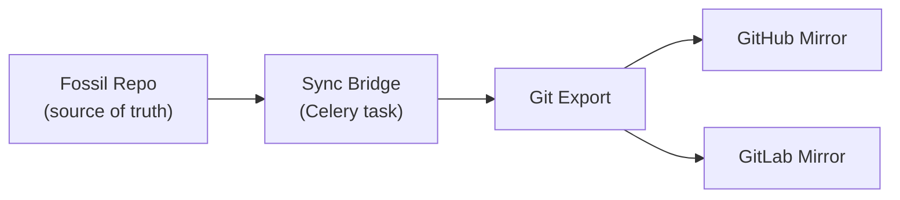

# Sync Bridge

The sync bridge mirrors Fossil repositories to GitHub and GitLab as downstream read-only copies.

## How It Works



The bridge:

1. Exports Fossil commits as Git commits
2. Pushes to configured Git remotes
3. Optionally syncs tickets to GitHub/GitLab Issues
4. Optionally syncs wiki pages to repo docs

## What Gets Synced

| Fossil Artifact | Git Target | Configurable |
|---|---|---|
| Commits | Git commits | Always |
| Tags | Git tags | Always |
| Branches | Git branches | Always |
| Tickets | GitHub/GitLab Issues | Optional |
| Wiki | Repository docs | Optional |

## Configuration

Set up mirroring through the Django management UI or environment variables:

```bash
# GitHub mirror
GITHUB_TOKEN=ghp_xxxxxxxxxxxx

# GitLab mirror
GITLAB_TOKEN=glpat-xxxxxxxxxxxx
```

Per-repository mirror configuration is managed in the dashboard under **Repository Settings > Sync**.

## Sync Modes

### On-Demand

Trigger a sync manually from the dashboard or CLI:

```bash
docker compose exec django python manage.py fossil_sync my-project
```

### Scheduled

Configure a Celery Beat schedule to sync at regular intervals:

```python
# Runs every 15 minutes
CELERY_BEAT_SCHEDULE = {
    'sync-all-repos': {
        'task': 'fossil.tasks.sync_all',
        'schedule': 900.0,
    },
}
```

### Upstream Pull

Pull updates from a remote Fossil server into your local instance:

```bash
docker compose exec django python manage.py fossil_pull my-project
```

!!! warning "Direction matters"
    The sync bridge is **one-way**: Fossil to Git. Changes pushed directly to a Git mirror will be overwritten on the next sync. Always push to the Fossil repo.
