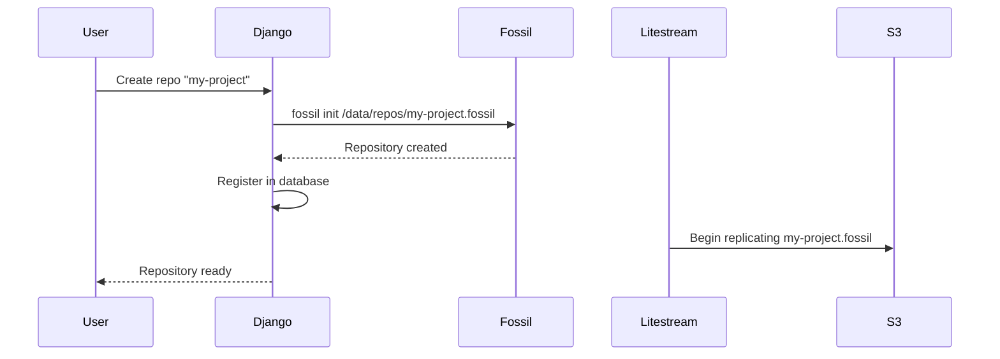

# Creating Your First Repository

Once fossilrepo is running, you can create your first Fossil repository.

## Via the Dashboard

1. Log in at `http://localhost:8000`
2. Navigate to **Repositories** in the sidebar
3. Click **Create Repository**
4. Enter a name (e.g., `my-project`)
5. Click **Create**

The repository is immediately available at `my-project.your-domain.com` (production) or through the local Fossil server (development).

## Via the CLI

```bash
# Inside the fossilrepo container
docker compose exec django python manage.py fossil_create my-project
```

This runs `fossil init`, registers the repo in the database, and (in production) Caddy automatically routes the subdomain.

## What Happens Under the Hood



## Accessing Your Repository

### Web UI

Fossil includes a built-in web interface with:

- **Timeline** -- commit history with diffs
- **Tickets** -- issue tracker
- **Wiki** -- project documentation
- **Forum** -- discussions

### Clone via Fossil

```bash
fossil clone https://my-project.your-domain.com my-project.fossil
fossil open my-project.fossil
```

### Clone via Git (Mirror)

If you've configured the sync bridge:

```bash
git clone https://github.com/your-org/my-project.git
```

!!! warning "Read-only mirror"
    Git mirrors are downstream copies. Push changes to the Fossil repo -- they'll sync to Git automatically.

## Next Steps

- [Configure the sync bridge](../architecture/sync-bridge.md) to mirror to GitHub/GitLab
- [Set up backups](configuration.md#litestream-backups) with Litestream
- Explore the [architecture overview](../architecture/overview.md)
